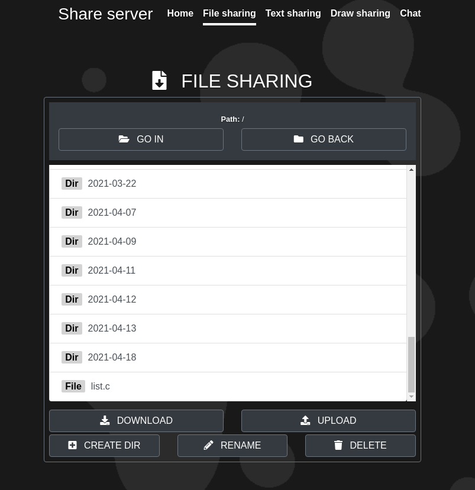
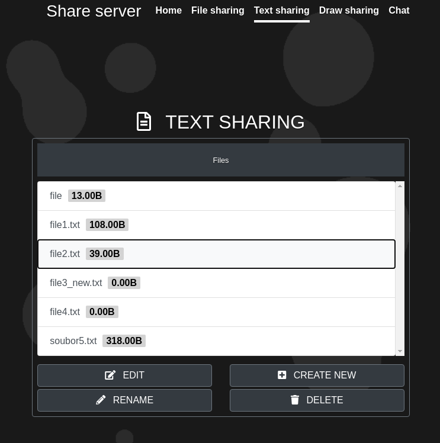
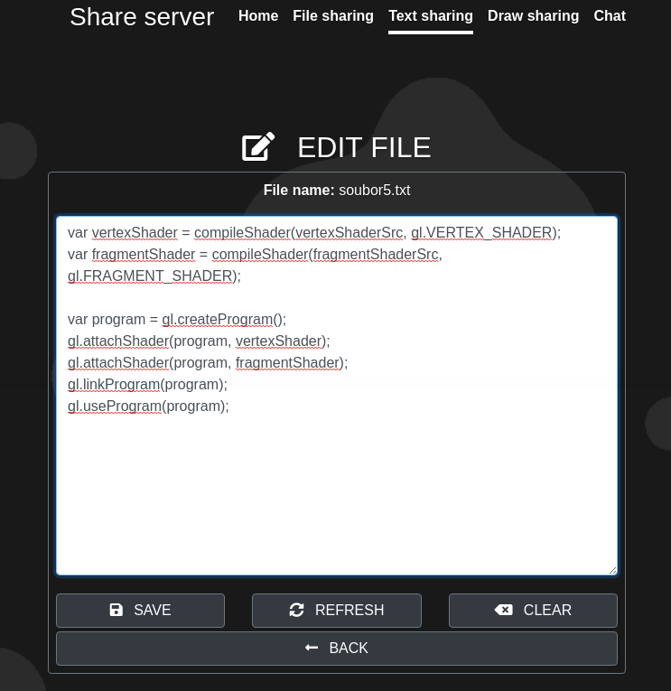
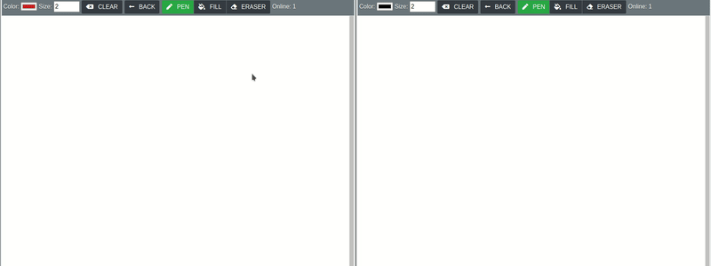

#Share Server
Share Server is a web application written mainly in php and javascript. It uses AJAX on the client side to communicate with the server. This application is designed to share information and this is possible in several ways. You can save any files to a shared storage, edit a text file shared between users, draw on a canvas in real time with other users, or write to other users simply by chat. The application requires a mysql database for its operation.

##File sharing
It is possible to upload any files to a shared storage. Any user can download these files. It is possible to rename and delete files that are on the storage. The newly uploaded file is included in the automatically generated folder with the current date or in the current folder in which the user is located (depending on the user's choice). It is also possible to create your own directories.

{:width="70%"}

##Text sharing
This allows users to change the contents of a particular file on a shared storage and then read the contents from it. The user can freely change the content of the text file, the changes are written to disk and after pressing the save button. Text files can be freely deleted and renamed.

{:width="70%"}

{:width="70%"}

##Draw sharing
Allows multiple users to draw on one canvas at a time. There are only basic drawing tools (pen, fill). It can create any amount of canvas on disk.

{:width="70%"}

##Chat